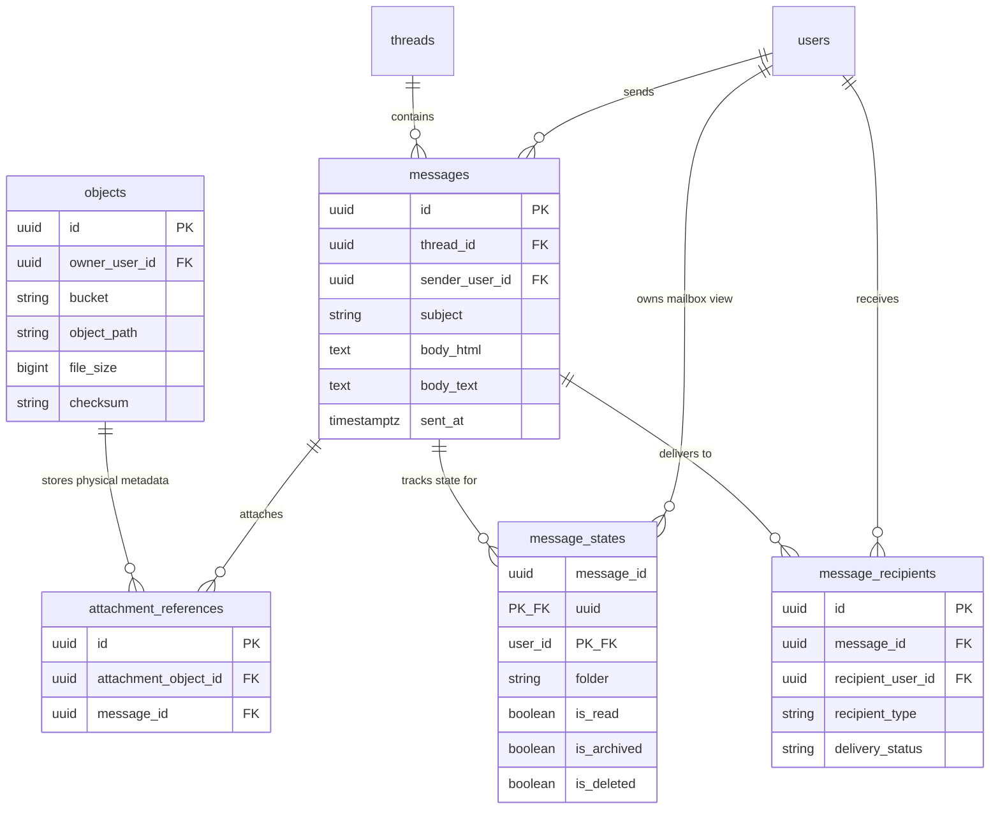

# MEXO Master Database Architecture Specification

**Database System**: Supabase PostgreSQL 15+  
**Architecture Pattern**: Centralized Ecosystem Identity + Product Schemas  
**API Layer**: Spring Boot (Spring Data JPA + Flyway)  
**Client Access**: React / TypeScript (Zero Direct DB Credentials in Browser)  

---

## 1. Executive Summary & Identity Strategy

The **MEXO Ecosystem** is built around a single, unified identity system: **MEXO Account**. 
Each user possesses **ONE permanent UUID primary key** (`user_id`) in `mexo_identity.users`.

```text
                               MEXO ACCOUNT
                                    │
                             user_id (UUID)
                                    │
           ┌────────────────────────┼────────────────────────┐
           ▼                        ▼                        ▼
      MEXO Mail                 MEXO Forms             Future Products
  (mexo_mail schema)        (mexo_forms schema)      (mexo_files schema)
```

- **Identity Primacy**: `manikandan@mexo.com` references `user_id = 550e8400-e29b-41d4-a716-446655440001`.
- **Ecosystem Scalability**: When MEXO Forms or MEXO Files are launched, users log in using the *exact same identity UUID*, eliminating separate credential databases.
- **Normalized Address Enforcement**: Usernames are stored as normalized case-insensitive `citext` to prevent identity spoofing (`Manikandan` = `manikandan`).

---

## 2. Security & Ownership Model

```text
React / TypeScript Frontend
            │
            │ HTTP / REST / TLS
            ▼
     Spring Boot API (Business Logic & Authorization)
            │
            │ JDBC / HikariCP Pool
            ▼
   Supabase PostgreSQL Infrastructure
```

- **Credential Isolation**: Supabase `service_role` keys, database passwords, and direct SQL connection strings remain strictly inside Spring Boot environment properties (`application.properties` / Vault).
- **Client Security**: The browser never executes direct SQL or possesses database table privileges.

---

## 3. Schema Topology

The database is logically partitioned into 8 PostgreSQL schemas:

| Schema Name | Purpose & Domain | Key Tables |
| :--- | :--- | :--- |
| `mexo_identity` | Central authentication, profiles, credentials, sessions, products | `users`, `profiles`, `credentials`, `sessions`, `reserved_usernames` |
| `mexo_mail` | Mailbox messaging, threads, recipient states, labels, drafts, filters | `threads`, `messages`, `message_recipients`, `message_states`, `labels` |
| `mexo_groups` | Distribution identity model and group membership management | `groups`, `group_members` |
| `mexo_contacts` | User address books and contact groups | `contacts`, `contact_groups`, `contact_group_members` |
| `mexo_storage` | Supabase Storage object metadata & deduplicated attachment references | `objects`, `attachment_references` |
| `mexo_notifications` | In-app notification delivery | `notifications` |
| `mexo_security` | Audit trail for security events, login attempts, & session revocations | `security_events`, `login_activity` |
| `mexo_admin` | Platform administrative action audit logs | `audit_logs` |

---

## 4. Entity Relationship (ER) Diagrams

### 4.1 Central Identity & Product Access

```mermaid
erDiagram
    users ||--o| profiles : "has profile"
    users ||--o| credentials : "has credentials"
    users ||--o{ recovery_methods : "has recovery options"
    users ||--o{ sessions : "maintains active sessions"
    users ||--o{ user_roles : "assigned"
    roles ||--o{ user_roles : "defines"
    users ||--o{ user_products : "uses"
    products ||--o{ user_products : "grants access"

    users {
        uuid id PK
        citext username UK
        citext primary_address UK
        string status
        timestamptz created_at
    }

    profiles {
        uuid user_id PK_FK
        string first_name
        string last_name
        string display_name
        string timezone
    }

    credentials {
        uuid id PK
        uuid user_id FK
        string credential_type
        string password_hash
    }

    sessions {
        uuid id PK
        uuid user_id FK
        string token_hash UK
        string device_name
        timestamptz expires_at
    }
```

### 4.2 Deduplicated Mail & Storage Pointer Architecture



---

## 5. Critical Data Architecture Rules

### 5.1 Single Message Body Store
When a user sends an email to 60 recipients (or a 60-member group):
- **1 row** is created in `mexo_mail.messages` containing `subject`, `body_html`, and `body_text`.
- **60 rows** are created in `mexo_mail.message_recipients` referencing `message_id` and `recipient_user_id`.
- **60 rows** are created in `mexo_mail.message_states` allowing each recipient to independently set `is_read`, `folder`, `is_archived`, or `is_deleted` without affecting other users.

### 5.2 Single Attachment Deduplication Architecture
When an attachment `report.pdf` (15 MB) is attached to a group email:
- **1 file** is stored in Supabase Storage (`mexo-mail-attachments/{ownerId}/{messageId}/{uuid}`).
- **1 row** is created in `mexo_storage.objects`.
- **1 row** is created in `mexo_mail.attachment_references`.
- **60 recipients** access the file through signed URLs validated against their `message_recipients` permission.
- **Physical disk footprint**: 15 MB (NOT 900 MB).

### 5.3 Distribution Identity Model for MEXO Groups
A group address such as `iii-it-a@mexo.com` is defined in `mexo_groups.groups`.
- It has **no password**, **no sessions**, and **no login capability**.
- When an email is addressed to `iii-it-a@mexo.com`, Spring Boot invokes `mexo_groups.dispatch_group_message()`, which resolves active members from `mexo_groups.group_members` and inserts individual `message_recipients` and `message_states` records.

---

## 6. Flyway SQL Migration Pipeline

All migrations are maintained in `supabase/migrations/` and executed automatically by Spring Boot Flyway on startup:

| Migration Script | Description |
| :--- | :--- |
| [`V1__mexo_identity_schema.sql`](file:///e:/MEXO/MEXO%20MAIL/supabase/migrations/V1__mexo_identity_schema.sql) | Schemas initialization, `users`, `profiles`, `credentials`, `sessions`, `roles`, `reserved_usernames` |
| [`V2__mexo_mail_schema.sql`](file:///e:/MEXO/MEXO%20MAIL/supabase/migrations/V2__mexo_mail_schema.sql) | Relational messaging, `threads`, `messages`, `message_recipients`, `message_states`, `labels`, `drafts` |
| [`V3__mexo_storage_schema.sql`](file:///e:/MEXO/MEXO%20MAIL/supabase/migrations/V3__mexo_storage_schema.sql) | `mexo_storage.objects` metadata and deduplicated `attachment_references` |
| [`V4__mexo_groups_schema.sql`](file:///e:/MEXO/MEXO%20MAIL/supabase/migrations/V4__mexo_groups_schema.sql) | MEXO Groups distribution identity model & local roles (`OWNER`, `MANAGER`, `MEMBER`) |
| [`V5__mexo_contacts_schema.sql`](file:///e:/MEXO/MEXO%20MAIL/supabase/migrations/V5__mexo_contacts_schema.sql) | User contact address book and relational contact groups |
| [`V6__mexo_platform_schema.sql`](file:///e:/MEXO/MEXO%20MAIL/supabase/migrations/V6__mexo_platform_schema.sql) | Notifications, security audit logs, login activity, and system admin audit trail |
| [`V7__mexo_indexes_and_functions.sql`](file:///e:/MEXO/MEXO%20MAIL/supabase/migrations/V7__mexo_indexes_and_functions.sql) | Performance indexes, GIN full-text search index, updated_at triggers, and stored group dispatch functions |
| [`V8__mexo_seed_data.sql`](file:///e:/MEXO/MEXO%20MAIL/supabase/migrations/V8__mexo_seed_data.sql) | Development seed data for roles, products, reserved handles, and sample test users |

---

## 7. Performance & Inbox Cursor Pagination

Inbox fetching uses a composite index over `(user_id, folder, is_deleted, updated_at DESC)` in `mexo_mail.message_states`:

```sql
-- High Performance Cursor Pagination Query Concept
SELECT m.id, m.subject, m.sender_address, ms.is_read, ms.updated_at
FROM mexo_mail.message_states ms
JOIN mexo_mail.messages m ON ms.message_id = m.id
WHERE ms.user_id = :authenticatedUserId
  AND ms.folder = 'inbox'
  AND ms.is_deleted = FALSE
  AND ms.updated_at < :cursorTimestamp
ORDER BY ms.updated_at DESC
LIMIT 50;
```

This ensures inbox loading is instantaneous regardless of total mailbox volume, avoiding expensive `OFFSET 50000` scans.
